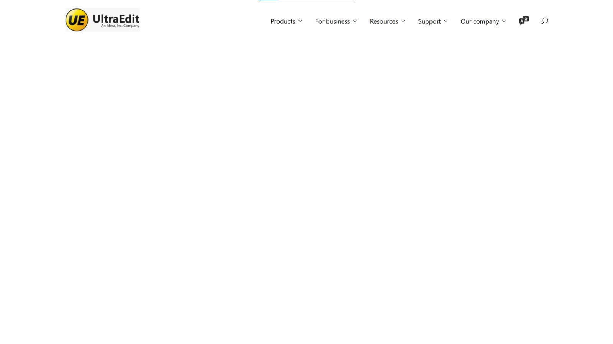

# Basic Navigation Bar with Flexbox

A simple, responsive navigation bar created using CSS Flexbox. This project demonstrates the use of Flexbox for layout and alignment, making the navigation bar adaptable to different screen sizes.

---

## 📸 Demo 



---

## Preview

Preview the website by visiting: [Preview](https://harshanandita.github.io/Flexbox-Navigation-Bar/) 

---

## 🛠 Features

- **Responsive Design**: Works seamlessly on both desktop and mobile devices.
- **Modern Layout**: Utilizes Flexbox for alignment and spacing.
- **Customizable**: Easy to adapt to your own styles and branding.
- **Lightweight**: Minimal HTML and CSS for quick implementation.

---

## 📂 File Structure

```plaintext
Flexbox Navigation Bar/
│
├── index.html          # Main HTML file
├── style.css           # CSS file for styling
├── README.md           # This README file 
└── assets/             # Folder for images and screenshots
    │
    ├── lang.png        # Language icon image
    ├── logo.png        # Logo image
    └── Sample.png      # Sample image 
```

---

## 💻 How to Use

1. Clone this repository:
```bash
git clone https://github.com/Harshanandita/Flexbox-Navigation-Bar.git
```

2. Navigate to the project folder:
```bash
cd Flexbox-Navigation-Box
```

3. Open `index.html` in your browser to view the navigation bar.

---

## 🔧 Technologies Used

- **HTML5**: For the structure of the navigation bar.
- **CSS3**: For styling and Flexbox layout

---

## Customization

To customize the navigation bar:
1. **Modify the links**: Open the `index.html` file and edit the `<a>` tags inside the navigation bar.
2. **Change the styles**: Edit the `styles.css` file to customize colors, fonts, or spacing.

---

## 📋 Installation for Development

If you'd like to edit or extend the project:
1. Clone the repository as shown above.
2. Use a code editor like VS Code to modify the files.
3. To view changes live, use a simple local server:
  - With Python:
  ```bash
  python -m http.server
  ```
  - With VS Code’s Live Server extension.

---

## 📜 License

This project is licensed under the MIT License - see the [LICENSE](https://opensource.org/licenses/MIT) file for details.

---

## 📬 Contact

Feel free to reach out for suggestions or questions:
- GitHub: Harshanandita
- Email: singh01ha@gmail.com
